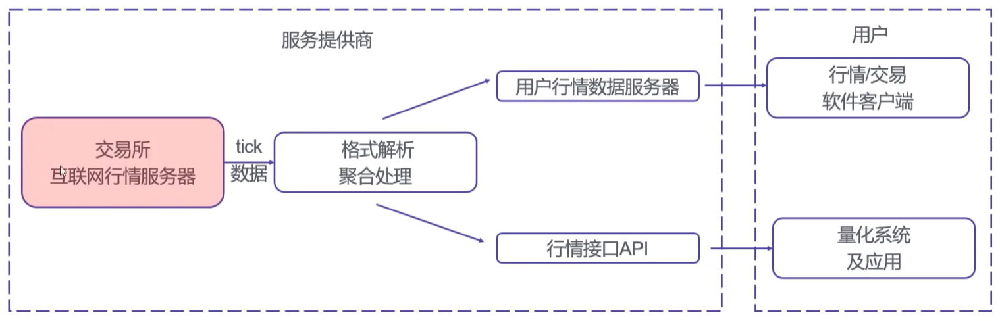

# 宝成资本 🧙

<!--
🙋‍♀️ BAOCHENG CAPITAL
🌈 Contribution guidelines - how can the community get involved?
👩‍💻 Useful resources - where can the community find your docs? Is there anything else the community should know?
 Fun facts - what does your team eat for breakfast?
🧙 Remember, you can do mighty things with the power of [Markdown](https://docs.github.com/github/writing-on-github/getting-started-with-writing-and-formatting-on-github/basic-writing-and-formatting-syntax)
-->

## A股中低频

| Data           |                                                              |
| -------------- | ------------------------------------------------------------ |
| Download       | 交易日历 股票列表 日线行情 申万行业 指数 ST停牌 涨跌停 |
| Clean          |                                                              |
| Feature/Factor | 趋势 动量 成交量 波动率 支撑与阻力 图表模式 |
|                | 盈利能力 成长性 财务健康状况 估值 其他   |
| Model/Strategy |                                                              |

## A股高频

| Data           |                        |
| -------------- | ---------------------- |
| Download       | 逐笔行情 快照行情 |
| Simulate       | 集合竞价 连续竞价 |
| Feature/Factor |                        |
| Model/Strategy |                        |

## 期货

## 期权

## 可转债

## 加密货币

| Data           |                                                              |                                                              |
| -------------- | ------------------------------------------------------------ | ------------------------------------------------------------ |
| Download       | Exchange API 单个/多个交易对Ticker/Kline数据       | https://coinmarketcap.com/zh/ REST API (Representational State Transfer) WebSocket API |
| Feature/Factor | 趋势 动量 成交量 波动率 支撑与阻力 图表模式 | \                                                            |
| Model/Strategy | Linear regression Logistic regression KNN K-Means Naive Bayes Neural networks Ensemble learning XGBoost 仓位管理 风险控制 | Total Returns Total Annualized Returns Algorithm Volatility Sharpe Max Drawdown |
| 实盘           | CCTX                                                         | \                                                            |

